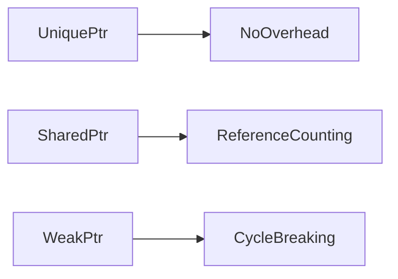
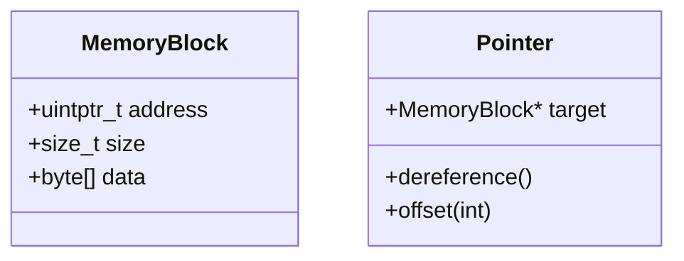

# Pointer Memory Mastery

## Core Patterns

### [[pointer-arithmetic]]
| Technique | Use Case | Performance Gain |
|-----------|----------|-------------------|
| SIMD Alignment | Multimedia Processing | 4-8x speedup |
| Cache Blocking | Large Datasets | 30-40% latency reduction |

### [[smart-pointers]]

- RAII pattern implementations
- Ownership models
## Performance Goldmine
➜ [[high-frequency-trading]] latency reduction  
➜ [[game-engine-development]] memory optimization

## Memory Visualization

```
  void optimize_memory_access(int* arr, size_t n) {
    // Cache-friendly iteration
    for (size_t i = 0; i < n; i += 16) {
        _mm_prefetch((char*)&arr[i+16], _MM_HINT_T0);
    }
}
```