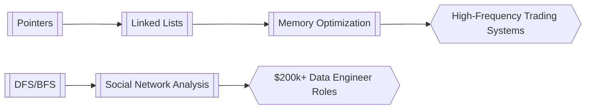

## 1. Foundational Concepts
- [[time-space-complexity.md]]
- [[recursion-vs-iteration.md]]
- [[Pointer Memory Mastery.md]]

## 2. Core Data Structures
- [[array-vs-vector-analysis.md]]
- [[singly-linked-list-operations.md]]
- [[doubly-linked-list-optimizations.md]]

## 3. Algorithm Paradigms
- [[two-pointer-technique]] 
  - Merge intervals
  - Sliding window patterns
- [[greedy-algorithm-patterns.md]]
  - Activity selection
  - Huffman coding
- [[divide-and-conquer-strategies.md]]
  - Merge sort
  - Quick select

## 4. Graph Theory Essentials
- [[dfs-bfs-comparison.md]]
  - Pathfinding
  - Connected components
- [[dijkstra-algorithm-deep-dive]]
  - Priority queue implementations
  - Negative weight handling

## 5. Advanced Problem Solving
- [[cycle-detection-techniques.md]]
  - Floyd's Tortoise & Hare
  - Graph cycle identification
- [[brute-force-optimization.md]]
  - Pruning strategies
  - Memorization approaches

## 6. Real-World Applications
- [[database-indexing-algos.md]]
- [[real-world-graph-problems.md]]
  - Social networks
  - Routing algorithms
- [[monetization-paths.md]]
  - Tech interview prep ($150+/hr. coaching)
  - Algorithmic trading systems
  - Route optimization SaaS

---

## Implementation Strategy

### 30-Day Crucible Plan
| Week | Focus Area | Deliverables | Monetization Action |
|------|------------|--------------|---------------------|
| 1 | Core DS | Implement all linked list variants | Create YouTube tutorial series |
| 2 | Algorithms | Solve 15 LeetCode pattern problems | Start algorithm coaching profile |
| 3 | Optimization | Benchmark different BFS implementations | Build pathfinding visualization SaaS |
| 4 | Integration | Combine graph algos with DB | Pitch logistics companies |

### Connection Matrix


---

## Pro Tips

1. **Pattern Recognition**:
   - Use [[brute-force-optimization.md]] as baseline before optimizing
   - Identify [[greedy-algorithm-patterns.md]] candidates with:
   ```python
   def is_greedy_viable(problem):
       return has_optimal_substructure(problem) and 
              has_greedy_choice_property(problem)
   ```

2. **Complexity Warfare**:
   - Convert O(n²) → O(n log n) using [[divide-and-conquer-strategies.md]]
   - Reduce space using [[two-pointer-technique]] instead of HashMap's

3. **Monetization Paths**:
   - Create algorithm cheat sheets ($29.99/digital pack)
   - Build interview prep platform (7% commission on mock interviews)
   - Contract with logistics companies for route optimization

---

**Next-Level Resources**  
1. [[advanced-graph-algos.md]] (A*, Topological Sort)  
2. [[dynamic-programming-decoded.md]]  
3. [[system-design-interviews.md]]  

