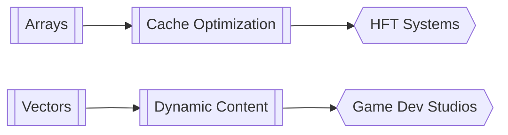

# Array vs Vector Analysis

## Key Components

[[memory-layout-comparison]]

- Contiguous allocation patterns
- Stack vs heap behavior

[[operation-complexity]]

- Random access: O(1) both
- Insertion: O(n) vs amortized O(1)

## Real-World Applications

➜ High-frequency trading systems (arrays)  
➜ Game engine development (vectors)

## Monetization Paths

💰 Tech interview coaching ($150/hr)  
💰 Open-source library optimization contracts

## Connection Matrix

