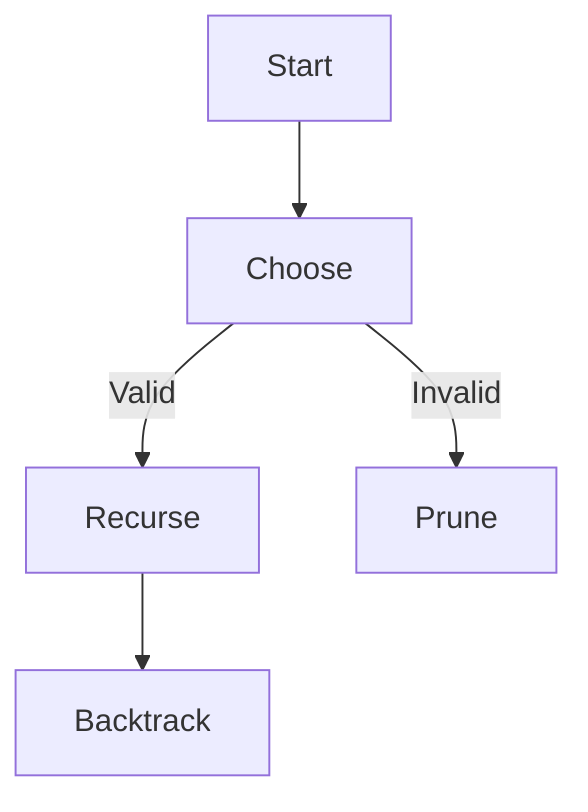

# Backtracking Patterns

## Decision Matrix

| Approach    | Time   | Space | Use Case        |
| ----------- | ------ | ----- | --------------- |
| Pruning     | O(n!)  | O(n)  | Permutations    |
| Memoization | O(2^n) | O(n)  | Subset problems |

## Optimization Path

1. Constraint propagation
2. Symmetry breaking
3. Parallel exploration

