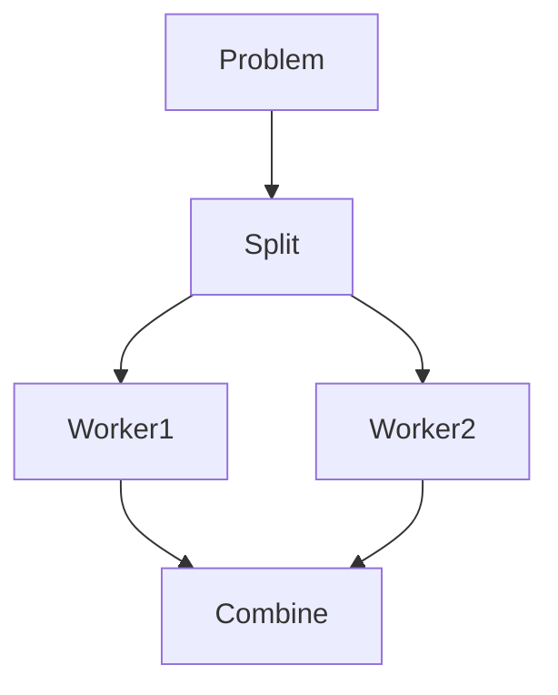

# Brute Force Optimization

## Core Patterns

### [[pruning-techniques]]
| Technique | Reduction Factor | Use Case |
|-----------|------------------|----------|
| Alpha-Beta | 50-70% | Game Trees |
| Memoization | 30-50% | DP Problems |

### [[parallelization]]

- Multi-threaded divide-and-conquer
- GPU acceleration

## Value Links
➜ Enables [[competitive-programming]] ($5000+ prizes)  
➜ Foundation for [[algorithmic-trading-systems]]  

## 30-Day Crucible Plan
| Week | Focus | Deliverable | Income Stream |
|------|-------|-------------|---------------|
| 1 | Pattern Recognition | 10 optimized solutions | YouTube Shorts |
| 2 | Space-Time Tradeoffs | Memory-mapped I/O system | Consulting |
| 3 | Hardware Integration | CUDA implementation | SaaS Beta |

## Pro Tip
```python
def optimize_brute_force(problem):
    while has_redundant_operations(problem):
        apply_memoization(problem)
        apply_pruning(problem)
    return problem