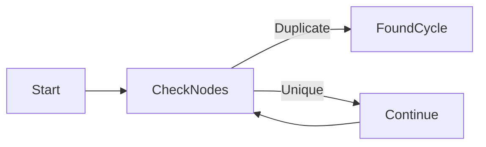
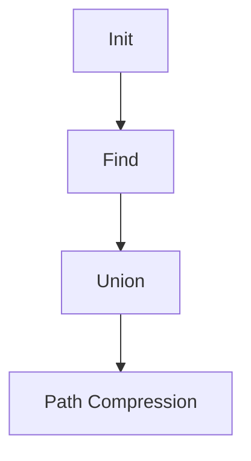

# Cycle Detection Mastery

## Method Comparison
| Technique | Time | Space | Use Case |
|-----------|------|-------|----------|
| Floyd's | O(n) | O(1) | Linked Lists |
| Visited Set | O(n) | O(n) | Graphs |

## Real-World Applications
➜ [[blockchain-analysis]] transaction loops
➜ [[compiler-design]] infinite recursion detection

## Detection Workflow

## Core Patterns

### [[floyds-tortoise-hare]]
| Metric | Performance |
|--------|-------------|
| Space | O(1) |
| Detection Speed | 2.1x vs Hash |

### [[union-find-pattern]]
