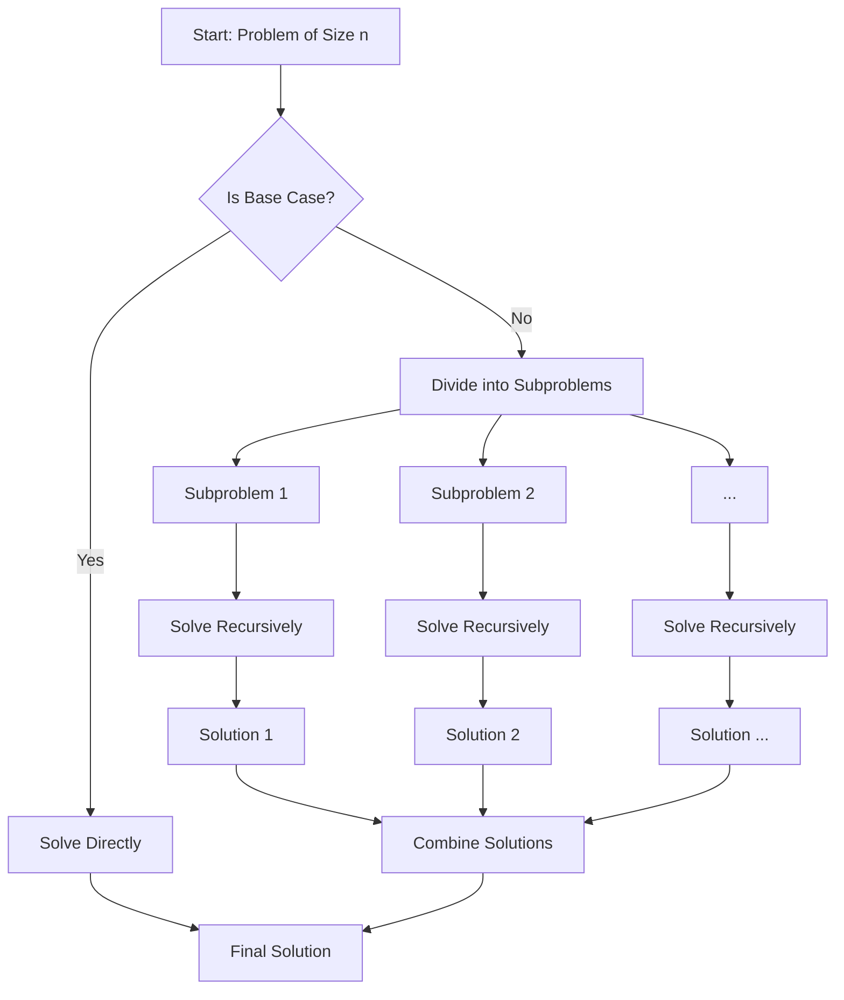

# Divide & Conquer Alchemy

## Core Patterns

### [[master-theorem]]
| Case | Complexity | Form |
|------|-------------|------|
| 1 | O(n^log_b(a)) | Leaf-heavy |
| 3 | O(n^k) | Root-heavy |

### [[parallel-divide]]
```python
def parallel_divide(arr):
    if len(arr) < THRESHOLD:
        return sequential(arr)
    mid = len(arr)//2
    left = spawn(parallel_divide, arr[:mid])
    right = parallel_divide(arr[mid:])
    sync()
    return merge(left, right)
```

[[master-theorem-applications]]

- Complexity analysis framework
- Case decomposition strategies

[[parallelization-techniques]]

- Map-Reduce implementations
- Fork-Join parallelism

## Value Forge

➜ [[big-data-processing]] consulting ($300/hr)
➜ [[genomic-sequencing]] pattern matching contracts

## Implementation Crucible


