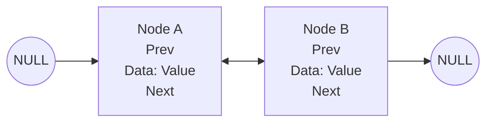

# Doubly Linked List Optimization

## Advantage Matrix
| Feature | Single | Double |
|---------|--------|--------|
| Reverse Traversal | O(n) | O(1) |
| Deletion | O(n) | O(1) |

## Cache Strategies
1. Page-aware memory allocation
2. Bulk node pre-fetching

## Real-World Uses
➜ [[browser-history]] implementation
➜ [[undo-redo-systems]] state management

