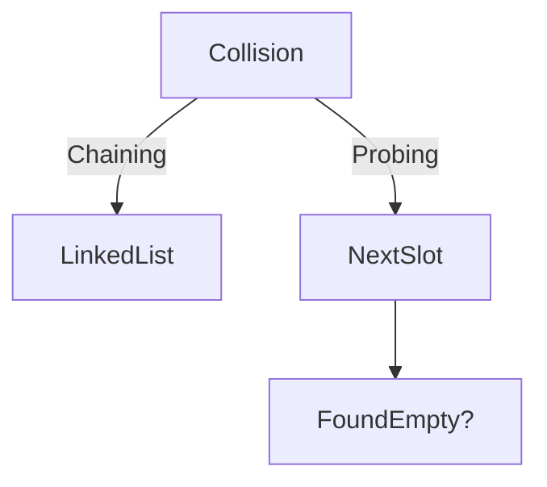

# Hashing Collision Resolution

## Resolution Showdown

| Method          | Load Factor | Worst Case | Best Use               |
| --------------- | ----------- | ---------- | ---------------------- |
| Chaining        | 0.7         | O(n)       | Dynamic datasets       |
| Open Addressing | 0.5         | O(n)       | Cache-friendly systems |

## Real-World Impact

➜ [[database-indexing]] quick lookups
➜ [[cryptography]] checksum verification

## Resolution Workflow

