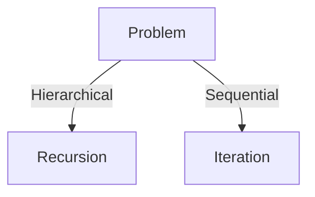

# Recursion vs Iteration

## Decision Matrix
| Factor | Recursion | Iteration |
|--------|-----------|-----------|
| Stack Depth | Limited | Unlimited |
| Memory | O(n) | O(1) |
| Readability | High | Medium |

## Transformation Techniques
1. Tail recursion optimization
2. Explicit stack simulation
3. Memoization patterns

## Real-World Uses
➜ Filesystem traversal (Recursion)
➜ Real-time sensor processing (Iteration)



## Conversion Alchemy
[[tail-recursion-transformation]]
- Stack frame reuse patterns
- Language-specific optimizations

## Monetization Paths
💰 Algorithmic art generation (recursive fractals)  
💰 High-performance computing contracts

## Code Wizardry
```python
def recursive_to_iterative(f):
    stack = []
    while True:
        result = f(*stack.pop())
        if is_base_case(result):
            return result
        stack.extend(prepare_next_args(result))