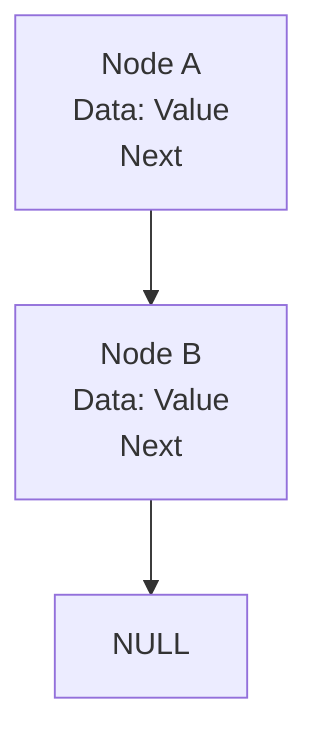

# Linked List Operations Mastery

## Core Patterns
| Operation | Time | Space | Optimization |
|-----------|------|-------|--------------|
| Insertion | O(1) | O(1) | Dummy head |
| Deletion | O(n) | O(1) | Two-pointer |

## Real-World Impact
➜ [[music-playlist]] track management
➜ [[blockchain]] transaction chains

## Memory Architecture
