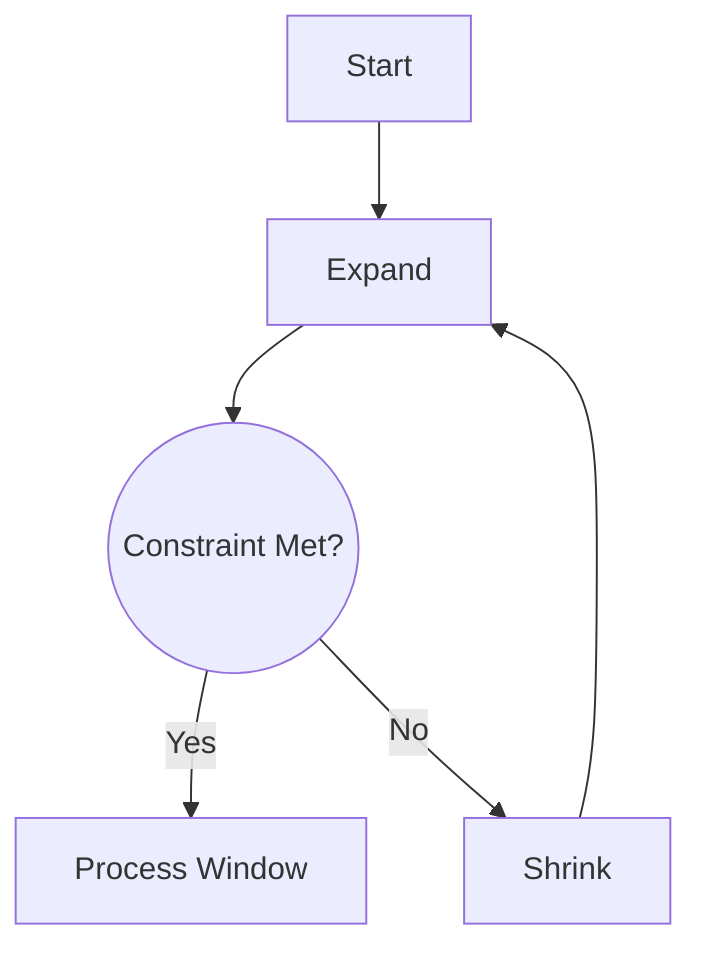

# Sliding Window Mastery

## Pattern Breakdown

| Window Type | Complexity | Ideal For  |
| ----------- | ---------- | ---------- |
| Fixed       | O(n)       | Averaging  |
| Dynamic     | O(2n)      | Substrings |

## Real-World Implementations

➜ [[network-analysis]] packet monitoring
➜ [[genomics]] DNA sequence scanning

## Window Optimization

## Core Patterns

### [[fixed-window]]
| Optimization          | Complexity | Real-World Use       |
|-----------------------|------------|----------------------|
| Pre-aggregation       | O(n) → O(1)| Network throughput   |
| Window memoization    | O(n) → O(k)| Real-time analytics  |

### [[dynamic-window]]

