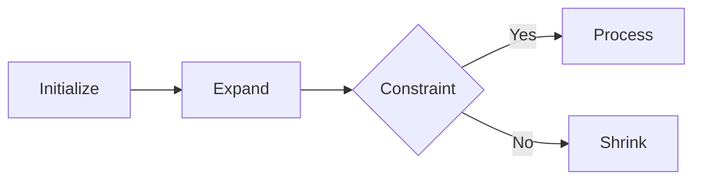

# Sliding Window Mastery

## Pattern Breakdown

| Window Type | Complexity | Ideal For  |
| ----------- | ---------- | ---------- |
| Fixed       | O(n)       | Averaging  |
| Dynamic     | O(2n)      | Substrings |

## Real-World Implementations

➜ [[network-analysis]] packet monitoring
➜ [[genomics]] DNA sequence scanning

## Window Optimization

