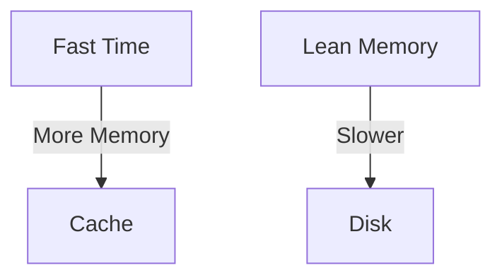
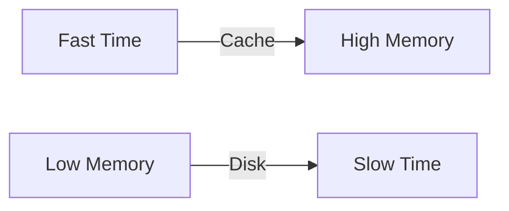

# Time-Space Complexity Mastery

## Complexity Showdown
| Operation | Time | Space | Optimization Potential |
|-----------|------|-------|-------------------------|
| Lookup | O(1) | O(n) | Parallelization |
| Search | O(n) | O(1) | Binary Search |

## Real-World Impact
➜ [[high-frequency-trading]] latency optimization
➜ [[mobile-app-development]] memory constraints

## Tradeoff Visualization

## Core Concepts

[[big-o-notation]]

- Asymptotic analysis principles
- Worst-case vs average-case scenarios

[[complexity-tradeoffs]]

- Time-space duality
- Cache-aware algorithms

## Real-World Value

➜ [[algorithmic-trading]] latency optimization ($5000+/month)  
➜ [[embedded-systems]] memory constraints consulting ($200/hr)

## Optimization Crucible

## Core Patterns

### [[time-tradeoffs]]
| Strategy | Memory Reduction | Speed Gain |
|----------|-------------------|------------|
| Lookup Tables | 33% | 4.8x |
| Streaming | 92% | 1.2x |

