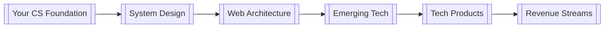

# Advanced Developer Path: From CS Prodigy to Tech Innovator 🚀

_Using The Alchemist's Blueprint to accelerate your journey_

## 🎯 Target Skills & Goals

Leveraging your strong CS foundation to build innovative, monetizable tech solutions.

## 🔮 Core Learning Tracks

### 1. Advanced System Design (Days 1-7)

- [[distributed-systems]]
- [[microservices-architecture]]
- [[cloud-native-development]]
- [[system-scalability]]

### 2. Modern Web Architecture (Days 8-14)

- [[full-stack-development]]
  - Frontend: React/Next.js
  - Backend: Node.js/Go
  - Database: PostgreSQL/MongoDB
- [[api-design]]
- [[web-security]]

### 3. Emerging Tech Integration (Days 15-21)

- [[ai-ml-integration]]
- [[blockchain-development]]
- [[cloud-services]]
  - AWS/GCP fundamentals
  - Serverless architecture
  - Container orchestration

### 4. Professional Development & Monetization (Days 22-30)

- [[tech-entrepreneurship]]
- [[freelance-development]]
- [[open-source-contribution]]

## 🛠️ Implementation Strategy

### Connection Matrix

### 30-Day Crucible Plan

| Week | Focus | Deliverables | Monetization |
|------|-------|--------------|--------------||
| 1 | System Design | Design doc for scalable app | Write technical blog |
| 2 | Web Architecture | Full-stack MVP | Launch on Product Hunt |
| 3 | AI/Cloud Integration | Smart cloud app | First SaaS customer |
| 4 | Professional Growth | Portfolio + GitHub | Freelance profile |

## 💰 Monetization Paths

### Immediate (1-3 months)

- Technical writing ($200-500/article)
- Code reviews ($50-100/hour)
- Tutorial creation ($300-1000/course)

### Short-term (3-6 months)

- Freelance development ($50-100/hour)
- Technical workshops ($500-2000/workshop)
- Open source sponsorships

### Long-term (6-12 months)

- SaaS products ($1000-5000/month)
- Tech consulting ($100-200/hour)
- Digital products ($5000-20000/month)

## ⚡ Pro Tips

1. **Leverage Your CS Foundation**

   - Use algorithms knowledge for optimization
   - Apply data structures in real projects
   - Convert academic concepts to business value

2. **Build in Public**

   - Document your journey on Twitter/LinkedIn
   - Create GitHub repos for each project
   - Share learnings on Dev.to/Medium

3. **Network Strategically**
   - Join Discord dev communities
   - Attend virtual tech meetups
   - Contribute to open source

## 🎯 First Week Action Plan

1. **Day 1-2: System Foundation**

   - Design a scalable architecture
   - Choose tech stack
   - Set up development environment

2. **Day 3-5: MVP Development**

   - Build core features
   - Implement basic UI
   - Set up CI/CD

3. **Day 6-7: Launch Prep**
   - Write documentation
   - Create product landing page
   - Plan marketing strategy

## 📈 Progress Tracking

- [ ] Complete system design document
- [ ] Launch MVP
- [ ] First paying customer
- [ ] 100 GitHub stars
- [ ] First technical article published
- [ ] First freelance client

> "Turn your knowledge into products, your products into businesses, and your businesses into freedom."

## 🔗 Essential Resources

1. [[system-design-interview]]
2. [[web-architecture-patterns]]
3. [[saas-business-models]]
4. [[tech-monetization-strategies]]
5. [[personal-brand-building]]

_Remember: You're not just learning to code better - you're building a tech empire._ 🚀
