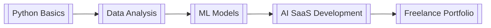

Here's a comprehensive markdown guide to teach "The Alchemist's Blueprint" learning method:


# The Alchemist's Blueprint  
*A Systematic Method to Learn **Anything** Faster and Monetize Your Knowledge*  

## 🔮 Core Principles  
1. **Chunking**  
   Break domains into atomic, interconnected concepts  
2. **Progressive Scaffolding**  
   Master fundamentals → build advanced applications  
3. **Value Chaining**  
   Explicitly link knowledge to real-world use cases  
4. **Anti-Fragile Learning**  
   Design systems that strengthen through use/errors  

---

## 🛠️ Step-by-Step Implementation  

### 1. Forge Your Roadmap  

- [ ] Identify target skill/domain (e.g., "AI Development")  
- [ ] Research industry-standard knowledge hierarchies  
- [ ] Create milestone structure:  
  
```
  Fundamentals → Core Concepts → Advanced Techniques → Monetization  
```
### 2. Craft Knowledge Atoms  
# Example: [[machine-learning-basics.md]]  

## Key Concepts  
[[supervised-learning]]  
[[neural-architectures]]  
[[loss-functions]]  

## Value Links  
➜ How this enables [[ai-app-development.md]]  
➜ Market demand: $350/hr ML engineering contracts  


### 3. Build Connection Matrix  


### 4. Implement the 30-Day Crucible  
| Day Range | Focus            | Outcome                   |  
|-----------|------------------|---------------------------|  
| 1-7       | Fundamentals     | 10+ atomic concept files  |  
| 8-14      | Core Projects    | 3 portfolio-ready demos   |  
| 15-21     | Advanced Links   | 5 cross-domain workflows  |  
| 22-30     | Monetization     | First paid gig/offer      |  

---

## 💡 Real-World Examples  

### Case 1: Coding Mastery  

[[python-basics]] → [[web-scraping]] → [[automation-tools]] →  
[[freelance-gigs]] → [[saas-product]]  

### Case 2: Business Strategy  

[[market-analysis]] → [[swot-frameworks]] → [[vc-pitching]] →  
[[startup-launch]] → [[exit-strategies]]  


---

## ⚡ Pro Tips  
1. **Leverage Tools**  
   - Use Obsidian/Logseq for [[wikilink]] knowledge gardens  
   - Automate with ChatGPT: "Generate 10 atomic concepts for [domain]"  
2. **Monetization Hacks**  
   - Package knowledge as:  
     - Mini-courses ($97-$297)  
     - Done-for-you templates ($50-$500)  
     - 1:1 consulting ($100+/hr)  
3. **Anti-Procrastination**  
   - Daily "5-Minute Mining": Add 3 new [[concepts]] daily  
   - Weekly "Value Forge": Connect knowledge to 1 income stream  

---

## ❓ FAQ  

**Q: How long to see results?**  
A: First monetization within 30 days if following the Crucible  

**Q: What if I get stuck?**  
A: Use the "Triple Jump":  
1. Google exact error + "site:github.com"  
2. ChatGPT: "Explain [concept] like I'm 10"  
3. Find 3 Reddit users who mastered it - reverse-engineer their path  

**Q: Best first domain to test this?**  
A: Either:  
- Your current job's adjacent skills (fastest monetization)  
- Your childhood passion (sustains motivation)  

--- 

> "Knowledge unused is dead weight.  
> Knowledge systematized is perpetual leverage."  
> ― The Alchemist's Manifesto  


This framework works for:  
- Career changers  
- Entrepreneurs  
- Students  
- Hobbyists turning pro  

Customizable templates/worksheets available 
1. [[Roadmap Builder Template]]
2. [[Knowledge Atom Template]]
3. [[Connection Matrix Worksheet]]
4. [[Areas/personal 1/30-day crucible planne]]
5. [[Monetization Canvas]]


