Based on your video transcript, here's a distilled **programming project roadmap** with key takeaways and actionable advice:

### **Key Problems Solved**
1. **"I don't know what to build"** → Curated project list for all levels
2. **Lost motivation** → Projects with instant gratification (coolness factor)
3. **Tutorial hell** → CodeCrafters' guided-but-not-handheld approach

---

### **Project Tier List** (Ranked by Impact)
| **Level**       | **Top Projects**                     | **Why Build?**                                                                 | **Learning Focus**                     |
|-----------------|--------------------------------------|--------------------------------------------------------------------------------|----------------------------------------|
| **Beginner**    | 1. Portfolio site 2. To-do list 3. Calculator | Fast wins; HTML/CSS/JS fundamentals                                            | DOM manipulation, basic logic          |
| **Intermediate**| 1. Smart mirror 2. Finance tracker 3. Realtime chat app | Combine hardware/APIs; tangible real-world use                                 | API integration, websockets, full-stack|
| **Advanced**    | 1. Neural network 2. Algorithm visualizer 3. Realtime editor | Deep CS concepts; resume gold                                                  | Math, data structures, collaboration   |
| **10x Dev**     | 1. Build Git/Redis 2. BitTorrent client 3. HTTP server | **Master systems programming**; understand foundational tools                  | Memory management, protocols, scaling  |

---

### **Critical Insights**
1. **Avoid "Hello World" Fatigue**:
   - Start with **visually rewarding projects** (smart mirror > calculator)
   - Attach projects to **personal needs** (finance tracker for budgeting)

2. **Kill Tutorial Hell**:
   > *"CodeCrafters guides force you to implement logic yourself while teaching core concepts"*  
   - Their *Build Your Own X* (Git/Redis/SQLite) reveals how core tools REALLY work

3. **Resume Hacks**:
   - Prioritize projects with **transferable skills**:
     - Realtime apps → Websockets (used in fintech/gaming)
     - Algorithm visualizer → Proves DSA knowledge better than LeetCode grinding

4. **Embrace Jank**:
   - Your "AI girlfriend" project (despite cringe) teaches:
     - Prompt engineering
     - API integration
     - Monetization (!)

---

### **Sponsor Break: CodeCrafters**
- **Why it solves your pain**:
  - Guides for **impossible-seeming projects** (DBs/torrent clients)
  - No copy-paste: You write code, they explain *why*
  - **40% discount** → [Link](https://codecrafters.io) (use for Redis/Git projects)
- **Ideal for**: Developers stuck in intermediate purgatory

---

### **Project Selection Flowchart**

```mermaid
graph TD
    A[“Stuck at 3AM?”] --> B{“Skill Level?”}
    B -->|Beginner| C[“To-do list / Portfolio”]
    B -->|Intermediate| D[“Smart mirror / Finance tracker”]
    B -->|Advanced| E[“Algorithm visualizer / Neural net”]
    B -->|“Want deep magic”| F[“CodeCrafters: Build Redis/Git”]
    C --> G[“Deploy on Netlify!”]
    D --> H[“Add realtime features”]
    E --> I[“Open-source it!”]
    F --> J[“You now understand infrastructure”]
```

### **Sloth’s Law of Coolness**
> *Coolness = (Novelty × Practicality) / Effort*  
- **Smart mirror**: High novelty + practicality → **10/10**  
- **QR generator**: Low novelty → **2/10** (unless it prints tacos)  

---

**Next step**: Pick **one** project and commit to shipping in 48 hours. Overthinking kills motivation! 🚀